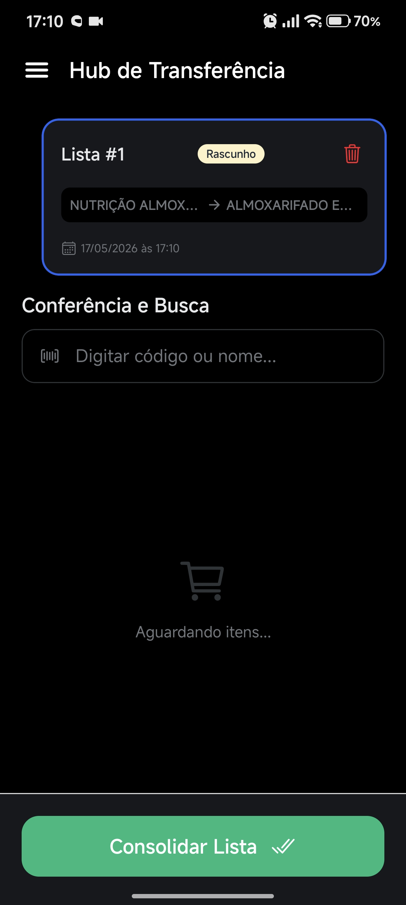
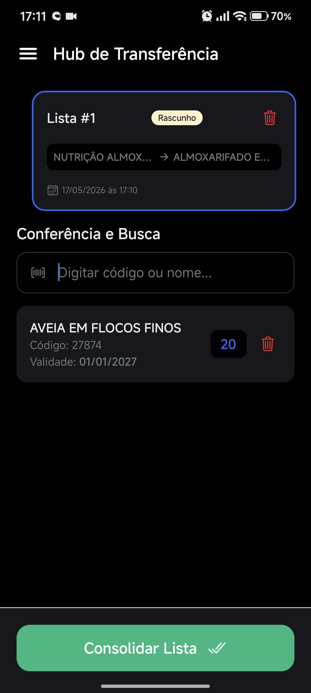
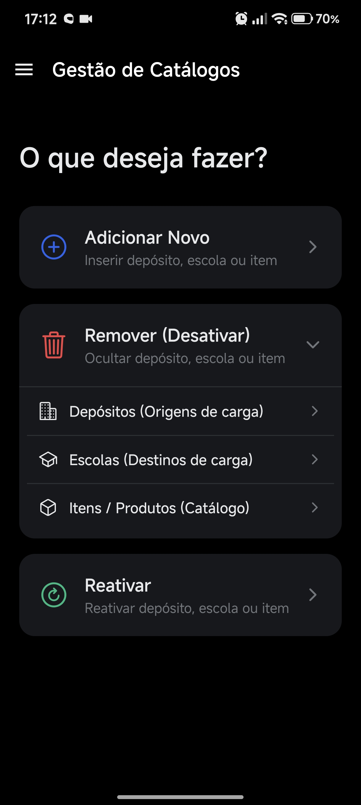
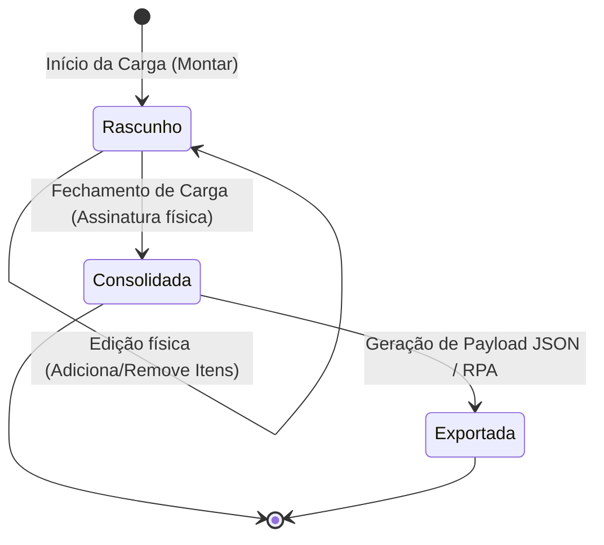
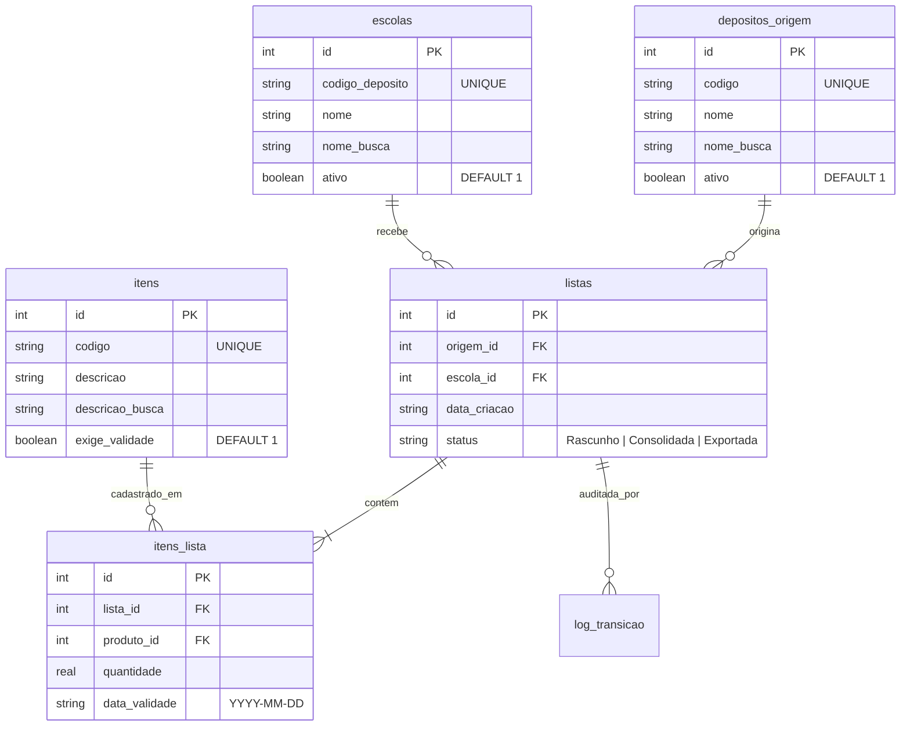

# 📦 TransferTool — Hub de Cargas Offline-First

[](file:///c:/dev/TransferTool/TransferTool_Vault/index.md)
[](file:///c:/dev/TransferTool/package.json)
[](file:///c:/dev/TransferTool/src/database/)
[](file:///c:/dev/TransferTool/src/__tests__/)

O **TransferTool** é uma aplicação móvel profissional desenvolvida sob medida para o **Almoxarifado Central Municipal**. Projetado para funcionar em ambientes com **zero conectividade** (offline-first), o aplicativo atua como um Coletor de Dados Inteligente e Gerador de Cargas, otimizando o fluxo logístico de distribuição de mantimentos (rancho escolar e materiais de consumo) para as escolas da rede municipal.

---

## 📸 Demonstração Visual e Fluxo Operacional

As telas foram desenhadas seguindo princípios rigorosos de **acessibilidade em ambiente fabril/galpão**, utilizando o elegante tema **All Black** (alto contraste, reduzindo fadiga visual e economizando bateria de coletores OLED/AMOLED).

````carousel

<!-- slide -->

<!-- slide -->

<!-- slide -->

<!-- slide -->

````

> [!NOTE]
> Para ver um vídeo completo do fluxo operacional do coletor móvel, assista ao arquivo gravado em: [Screenrecorder-2026-05-17-17-00-47-589.mp4](file:///c:/dev/TransferTool/assets/img/Screenrecorder-2026-05-17-17-00-47-589.mp4).

---

## 🏗️ Arquitetura de Software e Padrões de Design

O projeto segue padrões de engenharia de software de alta qualidade para garantir robustez, integridade dos dados e desacoplamento total.

### 🛡️ Padrão Strict MVC (Model-View-Controller)
Garante isolamento absoluto de responsabilidades:
* **Views (Telas React Native):** São passivas e puramente focadas em renderizar layout e escutar eventos do usuário. Não realizam queries SQL ou manipulam transações direta de dados.
* **Models (Camada de Domínio):** Gerenciam de forma estrita o estado e a persistência lógica de dados no banco local SQLite, representados por:
  - [ListaModel](file:///c:/dev/TransferTool/src/models/ListaModel.ts): Lógica de criação de rascunhos, consolidação e remoção de cargas.
  - [ItemModel](file:///c:/dev/TransferTool/src/models/ItemModel.ts): Adição, edição em carrinho logístico e busca parametrizada contra SQL Injection.
  - [CatalogoModel](file:///c:/dev/TransferTool/src/models/CatalogoModel.ts): Gestão em lote de CRUD offline e Soft Delete das entidades operacionais.

### 🔄 Padrão State (Ciclo de Vida da Carga)
Controla rigorosamente o fluxo de movimentação das cargas logísticas. O ciclo de vida é encapsulado e imutável após consolidação:



---

## 🗄️ Modelagem do Banco de Dados Offline (SQLite)

Para manter 100% de confiabilidade local, utilizamos o motor relacional nativo do **Expo SQLite** com integridade referencial ativa (`PRAGMA foreign_keys = ON`) e alto desempenho de escrita (`PRAGMA journal_mode = WAL`).

### Diagrama Entidade-Relacionamento (ERD)



---

## 💼 Regras de Negócio Centrais

1. **Bloqueio de Carga Consolidada:** Uma vez que o operador consolida a carga, ela é imutável. Não é permitido adicionar, alterar a quantidade ou excluir itens. Isso assegura a conformidade entre o material fisicamente embarcado no caminhão e a guia digital.
2. **Exigência Dinâmica de Data de Validade:** 
   - Se o produto for perecível (Ex: Alimentos — `exige_validade = 1`), o campo de data de validade é de preenchimento obrigatório com validação de máscara de data `DD/MM/AAAA`.
   - Se for não-perecível (Ex: Equipamentos ou limpeza — `exige_validade = 0`), o campo é ocultado na interface e gravado como `NULL`, aumentando a velocidade operacional no depósito.
3. **Auditoria Visual de Produtos Vencidos:** O sistema compara a data de validade digitada pelo operador com a data do sistema do coletor no momento da inserção. Se vencido, exibe imediatamente um alerta visual vermelho destacando `"Produto Vencido!"` no formulário para bloquear o envio de lotes impróprios para as escolas.
4. **Soft Delete do Catálogo:** A remoção de itens, depósitos ou destinos do catálogo utiliza a flag `ativo = 0`. Isso impede falhas de integridade em cargas existentes que já referenciam esses dados logísticos no histórico offline.

---

## 🤖 Integração ERP via Fluxo RPA (Automação de Processos)

O app gera um arquivo de exportação em JSON estritamente parametrizado apenas com códigos (elimina digitação manual do operador humano no ERP da prefeitura). O RPA faz a leitura do JSON e preenche o sistema ERP em segundos.

### Exemplo de Payload Gerado

```json
{
  "cabecalho": {
    "lista_id": 1,
    "origem_codigo": "DEP-ALIM-CENTRAL",
    "destino_codigo": "ESC-MACHADO-ASSIS",
    "data_criacao": "2026-05-17T16:40:00.000Z"
  },
  "itens": [
    {
      "produto_codigo": "2201",
      "quantidade": 150.0,
      "data_validade": "2027-12-10"
    },
    {
      "produto_codigo": "37357",
      "quantidade": 10.0,
      "data_validade": null
    }
  ]
}
```

---

## ⚙️ Como Executar e Testar

### Pré-requisitos
* Node.js instalado (v18+)
* Expo CLI instalado globalmente ou via npx

### Instalação
1. Clone o repositório
2. Instale as dependências:
   ```bash
   npm install
   ```

### Executando em Desenvolvimento
Para iniciar o bundler Metro e escolher a plataforma de execução (Android, iOS ou Web):
```bash
npm run start
```

### 🔬 Auditoria e Testes Rigorosos (Qualidade v1.0)
Para certificar que o código atende às exigências de estabilidade:

* **Checagem de Tipos Estática (TypeScript):**
  ```bash
  npx tsc --noEmit
  ```
* **Execução dos Testes Unitários de Integração (Jest):**
  ```bash
  npm run test
  ```

---

*Gerenciado com rigor profissional pelo PM Sênior de Agentes de IA do Projeto TransferTool — 2026*
