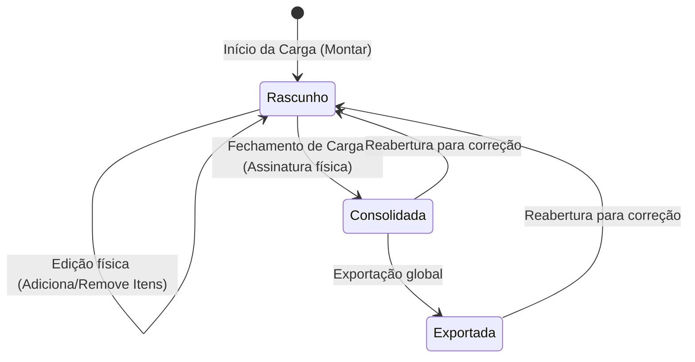
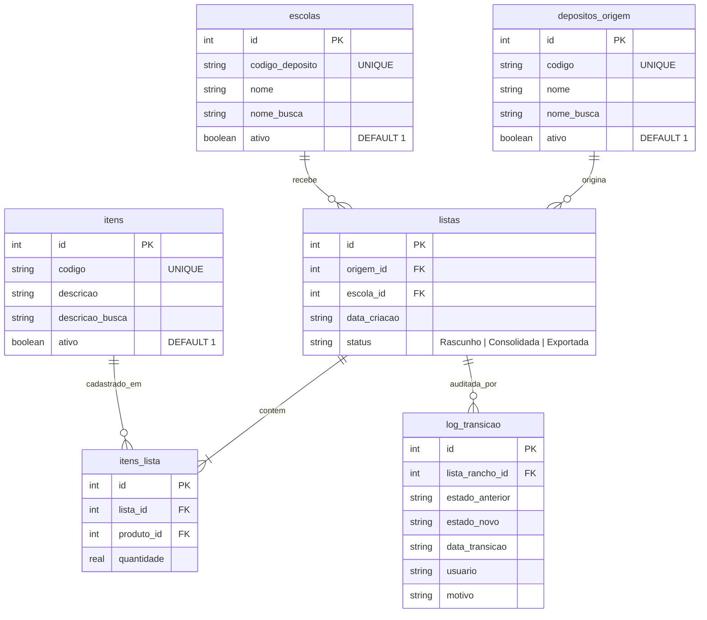

# 📦 TransferTool — Hub de Cargas Offline-First

[](#)
[](package.json)
[](src/database/)
[](src/__tests__/)

O **TransferTool** é uma aplicação móvel profissional desenvolvida sob medida para o **Almoxarifado Central Municipal**. Projetado para funcionar em ambientes com **zero conectividade** (offline-first), o aplicativo atua como um Coletor de Dados Inteligente e Gerador de Cargas, otimizando o fluxo logístico de distribuição de mantimentos (rancho escolar e materiais de consumo) para as escolas da rede municipal.

---

> 🔒 **Privacidade:** a ferramenta opera de forma **local** (banco SQLite no próprio dispositivo, sem sincronização com servidores) e **não expõe dados sensíveis** da prefeitura a terceiros.

---

## 🏗️ Arquitetura de Software e Padrões de Design

O projeto separa a interface, as regras do domínio e a persistência local para manter o fluxo de conferência organizado e testável.

### 🛡️ Separação de responsabilidades
* **Views (Telas React Native):** Capturam ações, exibem dados e apresentam erros. Não realizam escritas SQL nem controlam transações.
* **ListaRanchoService:** É a fronteira de escrita do agregado. Reidrata listas, delega as regras ao State Pattern e persiste alterações em transações SQLite.
* **ListaRancho e States:** Representam o domínio e controlam as operações permitidas em cada status.
* **Models de consulta:** `ListaModel` e `ItemModel` concentram consultas de histórico, catálogo e carrinho.
* **CatalogoModel:** Gerencia o CRUD offline do catálogo e o soft delete das entidades catalogadas.
* **ExportacaoModel:** Serializa e compartilha o arquivo JSON; a geração dos payloads pertence ao domínio.

### 🔄 Padrão State (Ciclo de Vida da Carga)
Controla as operações permitidas conforme o status da carga. A exportação global inclui listas consolidadas e exportadas, e listas consolidadas ou exportadas podem ser reabertas para correção:



---

## 🗄️ Modelagem do Banco de Dados Offline (SQLite)

Para manter 100% de confiabilidade local, utilizamos o motor relacional nativo do **Expo SQLite** com integridade referencial ativa (`PRAGMA foreign_keys = ON`) e alto desempenho de escrita (`PRAGMA journal_mode = WAL`).

### Diagrama Entidade-Relacionamento (ERD)



Itens de lista e registros de auditoria usam `ON DELETE CASCADE` quando a lista é excluída. A exclusão é física e pode remover também o histórico local da lista.

---

## 💼 Regras de Negócio Centrais

1. **Consolidação:** Uma lista em `Rascunho` precisa ter origem, destino e pelo menos um item para ser consolidada.
2. **Bloqueio por estado:** Listas `Consolidada` e `Exportada` não permitem adicionar, alterar ou remover itens diretamente.
3. **Reabertura:** Listas `Consolidada` e `Exportada` podem voltar para `Rascunho` para correções ou inclusão de itens.
4. **Exclusão:** A exclusão física é permitida em qualquer estado e remove a lista, seus itens e seu log local por cascata. O histórico oficial das cargas permanece no ERP de destino.
5. **Soft Delete do Catálogo:** A remoção de itens, depósitos ou destinos do catálogo utiliza a flag `ativo = 0`, preservando referências existentes.
6. **Validade:** Data de validade não faz parte do domínio atual. Bancos criados por versões anteriores têm as colunas obsoletas removidas durante a inicialização.

---

## 🤖 Integração ERP via Fluxo RPA (Automação de Processos)

O app gera um arquivo de exportação em JSON estritamente parametrizado apenas com códigos (elimina digitação manual do operador humano no ERP da prefeitura). O RPA faz a leitura do JSON e preenche o sistema ERP em segundos.

### Exemplo de Payload Gerado

O botão de exportação do Hub gera um único arquivo JSON em formato de array. Ele inclui listas `Consolidada` e `Exportada` em ordem cronológica. Listas em `Rascunho` não são incluídas.

O arquivo é nomeado no formato `Carga_<depósito de origem>_<DD-MM-YYYY>_<HHhsMMmin>.json` (ex.: `Carga_DEPÓSITO DE UNIFORMES_25-09-2026_14h30min.json`).

```json
[
  {
    "id_app": 1,
    "data_geracao": "2026-05-17T16:40:00.000Z",
    "codigo_origem": "DEP-ALIM-CENTRAL",
    "codigo_destino": "ESC-MACHADO-ASSIS",
    "itens": [
      {
        "codigos": ["2201"],
        "descricao": "ARROZ PARBOILIZADO",
        "quantidade": 150
      },
      {
        "codigos": ["37357"],
        "descricao": "LEITE EM PÓ",
        "quantidade": 10
      }
    ]
  }
]
```

---

## 🧪 Suíte de Testes Automatizados (Jest)

A suíte contém **30 testes** (Jest / `jest-expo`) cobrindo o domínio, os modelos e a serialização do payload:

| Arquivo | Foco |
| --- | --- |
| `ListaRancho.spec.ts` | Padrão State: transições, bloqueios e geração de payload |
| `ListaRanchoService.spec.ts` | Fronteira de escrita: transações, reidratação e exportação |
| `ExportacaoModel.spec.ts` | Payload RPA: códigos normalizados e descrição |
| `CatalogoModel.spec.ts` | CRUD offline e soft delete |
| `ListaModel.spec.ts` | Busca normalizada e histórico |
| `ListaOrdenacao.spec.ts` | Ordenação e reconciliação de listas |
| `dummy.test.ts` | Smoke test |

> Os testes de domínio usam mocks estruturais de `SQLiteDatabase`; eles **não** abrem um banco SQLite real.

---

## ⚙️ Como Executar e Testar

### Pré-requisitos
* Node.js instalado (v18+)
* Expo CLI instalado globalmente ou via npx

### Instalação
1. Clone o repositório
2. Instale as dependências:
   ```bash
   npm install
   ```

### Executando em Desenvolvimento
Para iniciar o bundler Metro e escolher a plataforma de execução (Android, iOS ou Web):
```bash
npm run start
```

### 🔬 Verificação local
Os comandos abaixo verificam os tipos e executam os testes Jest atuais. A suíte contém testes unitários, incluindo testes do domínio com SQLite simulado; ela ainda não substitui testes de integração com um banco SQLite real.

* **Checagem de Tipos Estática (TypeScript):**
  ```bash
  npx tsc --noEmit
  ```
* **Execução dos testes Jest:**
  ```bash
  npm run test
  ```

---

## 📚 Documentação e Referências

* [`CHANGELOG.md`](CHANGELOG.md): histórico de mudanças por versão.

---

## 📄 Licença

Distribuído sob a licença [GNU Lesser General Public License v3.0](LICENSE) (LGPLv3).

---

*Gerenciado e desenvolvido por Vitor Rodrigues da Rosa — Projeto TransferTool — 2026*
